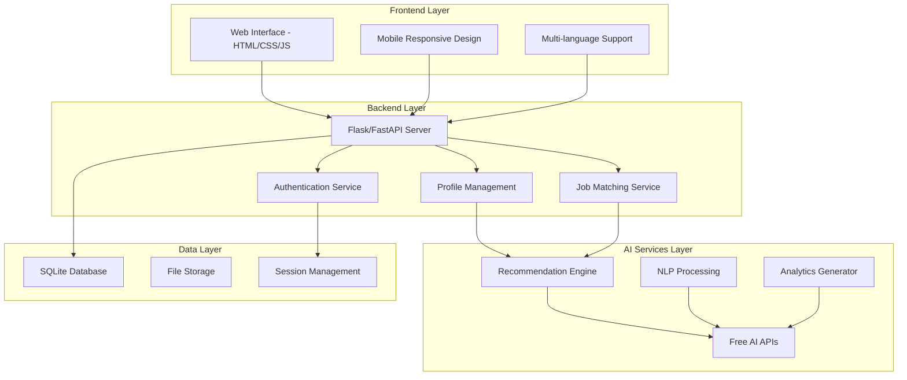

# Design Document

## Overview

The AI Career Platform is designed as a lightweight, demo-ready web application with a modular architecture supporting students, employers, and placement officers. The system leverages free AI APIs for natural language processing and recommendation algorithms, implements a responsive blue-grey themed interface, and provides core functionality without heavy computational requirements.

## Architecture

### System Architecture



### Technology Stack

**Frontend:**
- HTML5, CSS3 (Blue-Grey Theme), Vanilla JavaScript
- Bootstrap 5 for responsive design
- Chart.js for analytics visualization
- Minimal external dependencies for lightweight performance

**Backend:**
- Python Flask (lightweight web framework)
- SQLite database (file-based, no server required)
- JWT for authentication
- RESTful API design

**AI Integration:**
- Hugging Face Inference API (free tier)
- OpenAI API (free credits)
- Google's Universal Sentence Encoder via TensorFlow.js
- Simple rule-based fallbacks for demo reliability

## Components and Interfaces

### 1. User Management Component

**Student Interface:**
- Registration/Login forms with validation
- Profile creation wizard (multi-step form)
- Dashboard showing recommendations and job matches
- Profile editing and skill assessment tools

**Employer Interface:**
- Company registration and verification
- Job posting form with requirement specification
- Candidate browsing with AI-generated matches
- Application tracking and feedback system

**Placement Officer Interface:**
- Administrative dashboard with analytics
- Student progress monitoring
- Report generation and export tools
- System configuration and user management

### 2. AI Recommendation Engine

**Career Recommendation Service:**
```python
class CareerRecommendationEngine:
    def __init__(self):
        self.skill_career_mapping = {}
        self.ai_client = HuggingFaceClient()
    
    def generate_recommendations(self, student_profile):
        # Use free AI API for text analysis
        skills_analysis = self.ai_client.analyze_skills(student_profile.skills)
        academic_analysis = self.ai_client.analyze_academics(student_profile.academics)
        
        # Combine with rule-based matching
        career_matches = self.match_careers(skills_analysis, academic_analysis)
        return self.rank_recommendations(career_matches)
```

**Job Matching Algorithm:**
```python
class JobMatchingService:
    def match_candidates(self, job_requirements, candidate_pool):
        # Use semantic similarity via free APIs
        job_embedding = self.get_text_embedding(job_requirements)
        
        matches = []
        for candidate in candidate_pool:
            candidate_embedding = self.get_text_embedding(candidate.profile_text)
            similarity_score = self.calculate_similarity(job_embedding, candidate_embedding)
            matches.append((candidate, similarity_score))
        
        return sorted(matches, key=lambda x: x[1], reverse=True)
```

### 3. Analytics and Reporting Component

**Dashboard Widgets:**
- Skill gap heatmaps by department
- Placement trend line charts
- Industry demand pie charts
- Real-time statistics counters

**Export Functionality:**
- PDF report generation using ReportLab
- CSV data export for Excel compatibility
- Scheduled report delivery via email

## Data Models

### Student Profile Model
```python
class StudentProfile:
    id: int
    user_id: int
    personal_info: dict  # Name, contact, etc.
    academic_records: dict  # CGPA, courses, projects
    technical_skills: list  # Programming, tools, technologies
    soft_skills: list  # Communication, leadership, etc.
    co_curricular: list  # Clubs, competitions, certifications
    extra_curricular: list  # Sports, volunteering, hobbies
    career_interests: list  # Preferred domains
    created_at: datetime
    updated_at: datetime
```

### Job Posting Model
```python
class JobPosting:
    id: int
    employer_id: int
    title: str
    description: text
    required_skills: list
    preferred_qualifications: list
    experience_level: str
    location: str
    salary_range: dict
    application_deadline: date
    status: str  # active, closed, draft
    created_at: datetime
```

### Analytics Model
```python
class PlacementAnalytics:
    id: int
    student_id: int
    job_id: int
    placement_date: date
    salary: float
    company_name: str
    job_category: str
    student_branch: str
    student_district: str
    feedback_score: float
```

## Error Handling

### API Error Management
- Graceful fallbacks when AI APIs are unavailable
- Rate limiting protection for free API tiers
- Cached responses to reduce API calls
- User-friendly error messages for system failures

### Data Validation
- Client-side form validation with immediate feedback
- Server-side validation with detailed error responses
- File upload size and type restrictions
- SQL injection and XSS protection

### System Resilience
- Database connection pooling and retry logic
- Session timeout handling
- Automatic data backup mechanisms
- Performance monitoring and alerting

## Testing Strategy

### Unit Testing
- Model validation and business logic testing
- API endpoint testing with mock data
- AI service integration testing with fallback scenarios
- Database operation testing

### Integration Testing
- End-to-end user workflow testing
- Cross-browser compatibility testing
- Mobile responsiveness testing
- Performance testing under load

### User Acceptance Testing
- Student profile creation and recommendation flow
- Employer job posting and candidate matching
- Placement officer analytics and reporting
- Multi-language interface testing

## Security Implementation

### Authentication & Authorization
- JWT-based stateless authentication
- Role-based access control (RBAC)
- Password hashing using bcrypt
- Session management with secure cookies

### Data Protection
- Input sanitization and validation
- SQL parameterized queries
- File upload security scanning
- HTTPS enforcement for all communications

### Privacy Compliance
- Data anonymization for analytics
- User consent management
- Right to data deletion (GDPR compliance)
- Audit logging for data access

## Performance Optimization

### Frontend Optimization
- Minified CSS and JavaScript files
- Image compression and lazy loading
- Browser caching strategies
- Progressive web app features

### Backend Optimization
- Database query optimization with indexing
- API response caching
- Asynchronous processing for AI calls
- Connection pooling and resource management

### AI Service Optimization
- Response caching for similar queries
- Batch processing for multiple requests
- Fallback to simpler algorithms when APIs fail
- Rate limiting to stay within free tier limits

## Deployment Architecture

### Development Environment
- Local SQLite database
- Flask development server
- Environment variables for API keys
- Hot reloading for rapid development

### Demo Deployment
- Lightweight cloud hosting (Heroku, Railway, or Vercel)
- PostgreSQL for production database
- Static file serving via CDN
- Environment-based configuration management

### Scalability Considerations
- Modular microservices architecture
- Database sharding strategies
- Load balancing for high traffic
- Caching layers for improved performance